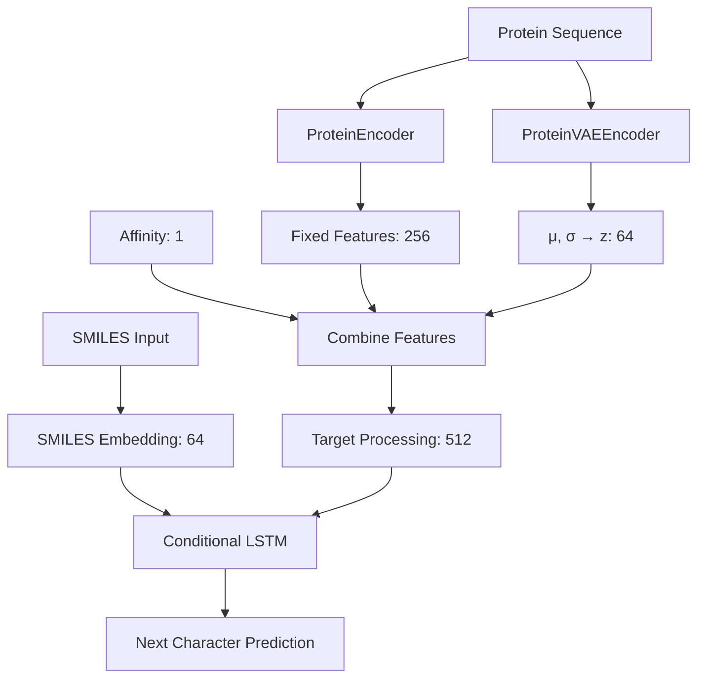
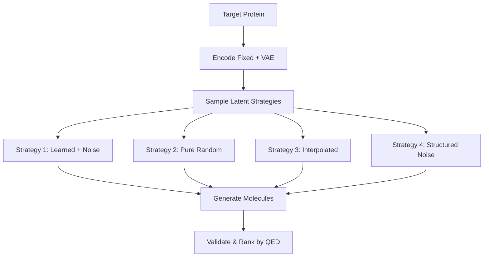

# MolGenX: VAE-Enhanced Conditional RNN for Protein-Targeted Molecule Generation

## Overview

 The model combines a **Variational Autoencoder (VAE)** with a **Conditional RNN** to enable both consistent protein-specific generation and diverse molecular exploration.

## Architecture Overview

```
PROTEIN SEQUENCE → [Dual Encoding] → [Feature Fusion] → [Conditional Generation] → MOLECULES
```

The model consists of **three main neural network components** working together:

### 1. **ProteinEncoder** (Deterministic Path)
### 2. **ProteinVAEEncoder** (Stochastic Path) 
### 3. **ConditionalRNNGenerator** (Molecule Generator)

---

## Model Components

### 🔹 **ProteinEncoder Class**

**Purpose**: Creates fixed, deterministic protein representations

```python
class ProteinEncoder(nn.Module):
    def __init__(self, vocab_size, embed_dim=128, hidden_dim=256, output_dim=256, num_layers=3):
```

**Architecture**:
```
Input Protein Sequence → Embedding → Bidirectional LSTM → Attention → Fixed Encoding
[batch_size, seq_len] → [embed_dim] → [hidden_dim×2] → [output_dim]
```

**Components**:
- **Embedding Layer**: Converts amino acid tokens to dense vectors (`embed_dim=64`)
- **Bidirectional LSTM**: 2-3 layers, captures sequence context in both directions
- **Attention Mechanism**: Focuses on important protein regions
  ```python
  attention = nn.Sequential(
      nn.Linear(hidden_dim * 2, hidden_dim),
      nn.Tanh(),
      nn.Linear(hidden_dim, 1),
      nn.Softmax(dim=1)
  )
  ```
- **Output**: Fixed protein representation (`output_dim=256`)

**Key Features**:
- **Consistent**: Same protein always produces same encoding
- **Interpretable**: Attention weights show important regions
- **Bidirectional**: Captures both forward and backward context

---

### 🔹 **ProteinVAEEncoder Class**

**Purpose**: Creates variable, stochastic protein representations for diversity

```python
class ProteinVAEEncoder(nn.Module):
    def __init__(self, vocab_size, embed_dim=128, hidden_dim=256, latent_dim=64, num_layers=2):
```

**Architecture**:
```
Input Protein → Embedding → BiLSTM → Attention → [μ, σ] → Latent Vector z
[batch_size, seq_len] → [embed_dim] → [hidden_dim×2] → [latent_dim]
```

**Components**:
- **Same Structure** as ProteinEncoder (embedding + BiLSTM + attention)
- **Variational Output**: Two separate heads
  ```python
  self.fc_mu = nn.Linear(hidden_dim * 2, latent_dim)      # Mean
  self.fc_logvar = nn.Linear(hidden_dim * 2, latent_dim)  # Log-variance
  ```
- **Reparameterization Trick**: `z = μ + σ * ε` where `ε ~ N(0,1)`

**Key Features**:
- **Diverse**: Different samples from same protein
- **Learnable**: Captures protein-specific molecular preferences
- **Controllable**: Latent space can be interpolated/modified

---

### 🔹 **ConditionalRNNGenerator Class**

**Purpose**: Generates SMILES strings character-by-character, conditioned on protein features

```python
class ConditionalRNNGenerator(nn.Module):
    def __init__(self, vocab_size, embed_dim, hidden_dim, target_encoding_dim, 
                 use_affinity=True, latent_dim=64):
```

**Architecture**:
```
SMILES Input + [Protein Features + Affinity + Latent z] → LSTM → Character Prediction
[embed_dim] + [target_encoding_dim + 1 + latent_dim] → [hidden_dim] → [vocab_size]
```

**Components**:

1. **SMILES Embedding**: Character-level embeddings
2. **Target Feature Processing**:
   ```python
   target_encoder = nn.Sequential(
       nn.Linear(target_input_dim, hidden_dim),  # Combine all conditions
       nn.LayerNorm(hidden_dim),
       nn.ReLU(),
       nn.Linear(hidden_dim, hidden_dim),
       nn.LayerNorm(hidden_dim)
   )
   ```
3. **Conditional LSTM**: Combines SMILES + conditions
   ```python
   lstm = nn.LSTM(embed_dim + hidden_dim, hidden_dim, num_layers=3, dropout=0.2)
   ```
4. **Output Network**: Character prediction
   ```python
   output_network = nn.Sequential(
       nn.Linear(hidden_dim, hidden_dim),
       nn.ReLU(),
       nn.Dropout(0.1),
       nn.Linear(hidden_dim, vocab_size)
   )
   ```

**Key Features**:
- **Multi-Modal**: Handles protein + affinity + latent conditioning
- **Sequential**: Character-by-character generation
- **Flexible**: Can work with/without affinity values

---

## Information Flow

### **Training Phase**:


### **Generation Phase**:


---

## Key Model Features

### **1. Dual Protein Encoding**
- **Fixed Path**: Consistent protein representation (ProteinEncoder)
- **Variable Path**: Diverse latent representation (ProteinVAEEncoder)
- **Combined**: Best of both - consistency + diversity

### **2. Multi-Modal Conditioning**
Input dimensions: `[protein_features(256) + affinity(1) + latent_z(64)] = 321`

### **3. β-VAE Training**
```python
total_loss = reconstruction_loss + β * kl_divergence_loss

# Cyclical β annealing:
if epoch < 30% of cycle:
    β = 0.00001 * (progress / 0.3)  # Gradual increase
else:
    β = 0.00001  # Small constant value
```

### **4. Advanced Generation Strategies**
The model uses **4 rotating latent sampling strategies**:

1. **Learned + Noise**: `z = z_learned + ε * noise_factor`
2. **Pure Random**: `z ~ N(0, I)`
3. **Interpolated**: `z = α * z_learned + (1-α) * z_random`
4. **Structured Perturbation**: `z = z_learned + structured_noise`

---

## Model Dimensions

| Component | Input Shape | Hidden | Output Shape |
|-----------|-------------|--------|--------------|
| **ProteinEncoder** | `[batch, seq_len, 64]` | `256×2` | `[batch, 256]` |
| **ProteinVAEEncoder** | `[batch, seq_len, 64]` | `256×2` | `[batch, 64]` |
| **ConditionalRNN** | `[batch, seq_len, 576]` | `512` | `[batch, seq_len, vocab_size]` |

**Combined Input to Generator**:
```python
combined_features = torch.cat([
    protein_features,    # [batch, 256]
    affinity,           # [batch, 1] 
    latent_z            # [batch, 64]
], dim=1)              # Result: [batch, 321]
```

---

## Usage Examples

### **Training**
```bash
python cycle.py \
    --data_path bindingDB.csv \
    --use_affinity \
    --epochs 30 \
    --batch_size 32 \
    --embed_dim 64 \
    --hidden_dim 256 \
    --output_dim 256 \
    --latent_dim 64 \
    --save_dir ./models
```

### **Generation for Single Target**
```bash
python cycle_loading.py \
    --model_path ./models/best_model.pt \
    --target "MKWVTFISLLFLFSSAYSRGVFRRDAHK..." \
    --affinity 0.7 \
    --n_molecules 10
```

### **Evaluation with CSV Input**
```bash
python eval.py \
    --model_path ./models/best_model.pt \
    --csv_file targets.csv \
    --num_molecules 100 \
    --output_dir evaluation_results
```

---

## File Structure

```
MolGenX-backend/VAEwithCondRNN/
├── cycle.py              # Main training script with all model classes
├── cycle_loading.py      # Model loading and generation utilities  
├── eval.py              # Evaluation script with property analysis
├── models/              # Saved model checkpoints
├── preprocessed_cache/  # Cached preprocessed data
└── evaluation_results/  # Generated evaluation outputs
```

---

## Core Classes Summary

### **ProteinEncoder**
- **Purpose**: Fixed protein representation
- **Input**: Protein sequence tokens
- **Output**: Deterministic 256-dim vector
- **Key**: Attention-weighted BiLSTM encoding

### **ProteinVAEEncoder**  
- **Purpose**: Variable protein representation
- **Input**: Protein sequence tokens
- **Output**: Latent vector z (64-dim) via μ, σ
- **Key**: Reparameterization trick for diversity

### **ConditionalRNNGenerator**
- **Purpose**: SMILES generation
- **Input**: SMILES tokens + protein conditions
- **Output**: Next character probabilities
- **Key**: Multi-modal conditioning with LSTM

### **BindingDBDataset**
- **Purpose**: Data preprocessing and loading
- **Features**: GPU acceleration, caching, tokenization
- **Output**: Batched tensors for training

---

## Generation Techniques

### **Temperature Scaling**
- Controls randomness: Higher = more diverse
- Adaptive: Increases if no valid molecules found

### **Top-k Sampling**  
- Early generation: k=5 (diverse)
- Mid generation: k=4 (balanced)
- Late generation: k=3 (focused)

### **Drug-likeness Biasing**
- Boosts probability of drug-like characters
- Position-aware: Different biasing at different stages
- Characters: `c, n, o, s, N, O, S, 1-6, (, ), =, F, Cl`

### **Repetition Penalty**
- Prevents character loops
- Tracks last 8 tokens
- Penalty increases with repetition count

---

##Why This Architecture?

### **Advantages**:
1. **Dual Representation**: Fixed + variable encoding = consistency + diversity
2. **Protein-Aware**: Learns protein-specific molecular preferences  
3. **Controllable**: Multiple generation strategies and parameters
4. **Scalable**: Efficient GPU utilization and caching
5. **Validated**: RDKit integration for chemical validity

### **Applications**:
- **Lead Optimization**: Generate variants for specific targets
- **Virtual Screening**: Create focused chemical libraries  
- **Drug Discovery**: Explore novel chemical space
- **Structure-Activity Relationships**: Study target-specific patterns

---

## Output Analysis

The evaluation script (`eval.py`) provides comprehensive analysis:

### **Molecular Properties Calculated**:
- **QED**: Quantitative Estimate of Drug-likeness
- **LogP**: Lipophilicity (octanol-water partition coefficient)
- **Molecular Weight**: Daltons
- **TPSA**: Topological Polar Surface Area
- **HBA/HBD**: Hydrogen bond acceptors/donors
- **Lipinski Violations**: Rule of Five compliance
- **Rotatable Bonds**: Molecular flexibility

### **Visualizations Generated**:
- Property distribution histograms
- Drug-likeness threshold analysis  
- Lipinski Rule of Five compliance
- Summary statistics and rankings

This architecture represents a state-of-the-art approach to **conditional molecular generation**, combining the power of variational autoencoders with the specificity of protein conditioning for targeted drug discovery applications! 